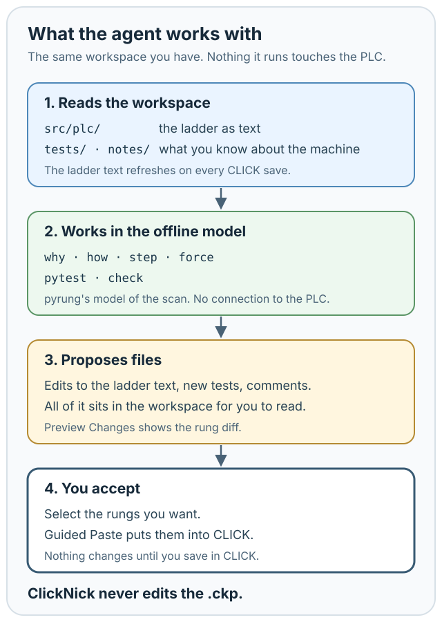

# Curious about AI? Give it a workspace you can check.

**Tour 6 of 6**

AI is optional. If you use a coding agent, point it at the workspace, not the `.ckp`.

The agent gets the same program, the same tests, and the same command-line checks you have. Start with work that's easy to inspect:

1. Explain a rung or trace a tag.
2. Suggest clearer comments and nicknames.
3. Write a test that pins down existing behavior.
4. Review a proposed change and run the checks.
5. Then, if it has earned it, propose ladder changes.

Everything it runs is pyrung's offline model. It has no connection to the PLC, and its ladder changes come back the way yours do: Preview Changes, your selection, Guided Paste through CLICK.

[Install ClickNick](../install.md) · [Help](../help/index.md) · [GitHub](https://github.com/ssweber/clicknick)

> **ClickNick never edits your `.ckp`.**
>
> Tag edits sync through the Address Editor. Rung edits are selected and pasted through CLICK's own ladder workflow. Both become part of the project only when you save in CLICK Programming Software. [Where ClickNick writes.](../help/index.md#where-clicknick-writes)
