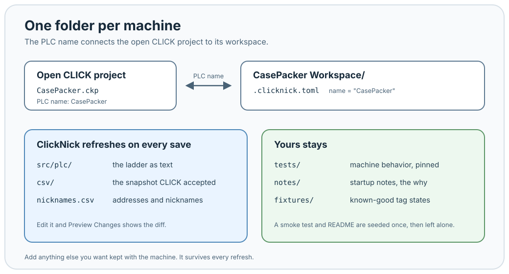

# Keep the engineering work with the CLICK project

**Tour 5 of 6**

A workspace is a folder that links up with your open project. ClickNick fills it with your ladder (as Python) after every save. Everything else in it is yours: startup notes, test cases, known-good tag states, fault reproductions, the explanation somebody will need during the next shutdown. Today that's scattered across a Downloads folder and one person's memory.

The folder carries the CLICK PLC name, so reopening that project reconnects to the same folder. Put it under Git if you want reviewed history and off-machine backups. It's useful either way.

---

**[Next: AI in the workspace →](ai-in-the-workspace.md)**
